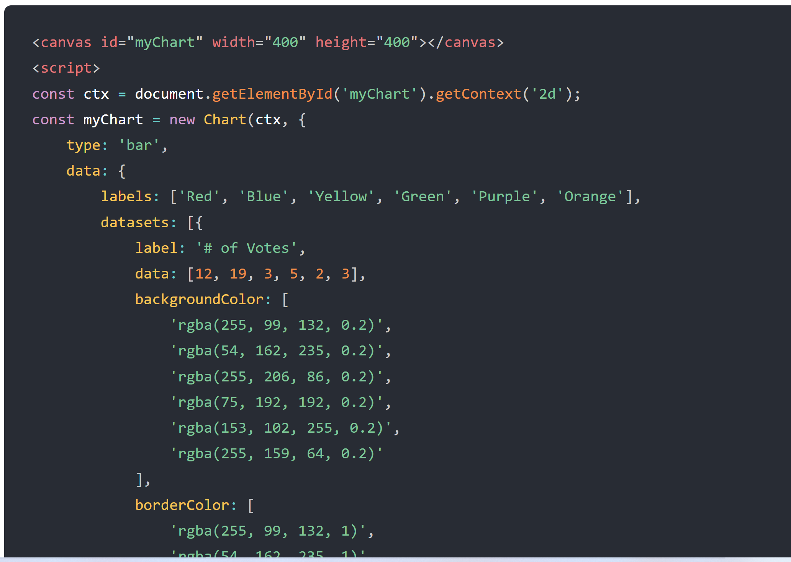

# Chart.js, Canvas

## Canvas

- HTML features the canvas element that allows you to draw 2D graphics using JS. The canvas element requires at least two attributes: width and height that specify the size of the canvas. Like other elements, you can access the width and height properties of the canvas element via its DOM properties:

- 

- The canvas element requires the closing tag of canvas, and any content between the opening and closing tags is ***fallback*** content that will display only if the browser doesn't support the canvas element.

- The canvas element features the getContext() method that returns a render context object. It takes one argument which is the type of context.

## Chart.js Documentation

- Here is an example of Chart.js:

- 

## Amazing Animated Charts

- Charts are far better for displaying data visually than tables and have the added benefit that no one is ever going to push them to use as a layout tool.

## Things I want to Know About

[Home](https://keelen-fisher.github.io/new-repository/)
