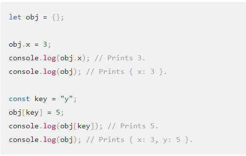

# Operators and Loops

## Starting off with operators

- There are 10 types of Operators:

    - [Assignemnt operators](https://developer.mozilla.org/en-US/docs/Web/JavaScript/Guide/Expressions_and_Operators#assignment_operators)

    - [Comparison operators](https://developer.mozilla.org/en-US/docs/Web/JavaScript/Guide/Expressions_and_Operators#comparison_operators)

    - [Arithmetic operators](https://developer.mozilla.org/en-US/docs/Web/JavaScript/Guide/Expressions_and_Operators#arithmetic_operators)

    - [Bitwise operators](https://developer.mozilla.org/en-US/docs/Web/JavaScript/Guide/Expressions_and_Operators#bitwise_operators)

    - [Logical operators](https://developer.mozilla.org/en-US/docs/Web/JavaScript/Guide/Expressions_and_Operators#logical_operators)

    - [String operators](https://developer.mozilla.org/en-US/docs/Web/JavaScript/Guide/Expressions_and_Operators#string_operators)

    - [Conditional (ternary operator)](https://developer.mozilla.org/en-US/docs/Web/JavaScript/Guide/Expressions_and_Operators#conditional_ternary_operator)

    - [Comma operator](https://developer.mozilla.org/en-US/docs/Web/JavaScript/Guide/Expressions_and_Operators#comma_operator)

    - [Unary operators](https://developer.mozilla.org/en-US/docs/Web/JavaScript/Guide/Expressions_and_Operators#unary_operators)

    - [Relational operators](https://developer.mozilla.org/en-US/docs/Web/JavaScript/Guide/Expressions_and_Operators#relational_operators)

- The only focus for now will be ***Comparison operators*** and ***Assignemnt operators*** for now.

An assingnment operator creates a value to the left operand depending on the value of its right operand the simple assignment is (=),  and this operator can assign the value of the right operand to the left operand. Only at the condition that the entire assignment assigns to it's correct value.

### Assigning to properties

- If an expression evaluates to an object, then the left-hand side of an assignment expression may make assignments to properties of that expression. For example:

### Comparison operators

a += b: easier way to say a = a + b

==: Means that it's somewhat equal to each other

!=: Not equal to

||: or

[===]:  Strick equal to

&&: A logical *and*

- Remainder (%): Binary operator. Returns the integer remainder of dividing the two operands.

> 12 % 5 returns 2.

- Increment (++): Unary operator. Adds one to its operand. If used as a prefix operator (++x), returns the value of its operand after adding one; if used as a postfix operator (x++), returns the value of its operand before adding one.

> If x is 3, then ++x sets x to 4 and returns 4, whereas x++ returns 3 and, only then, sets x to 4.

- Decrement (--): Unary operator. Subtracts one from its operand. The return value is analogous to that for the increment operator.

> If x is 3, then -x returns -3.

- Unary plus (+): Unary operator. Attempts to convert the operand to a number, if it is not already.

> +"3" returns 3. +true returns 1.

- Exponentiation operator (**): Calculates the base to the exponent power, that is, base^exponent.

## Loops

- While Loops (potentially infinite) can run as long as the user enters a different answer from the expected outcome.

- For Loops runs however many number that the pprogrammer inserts into its code.
